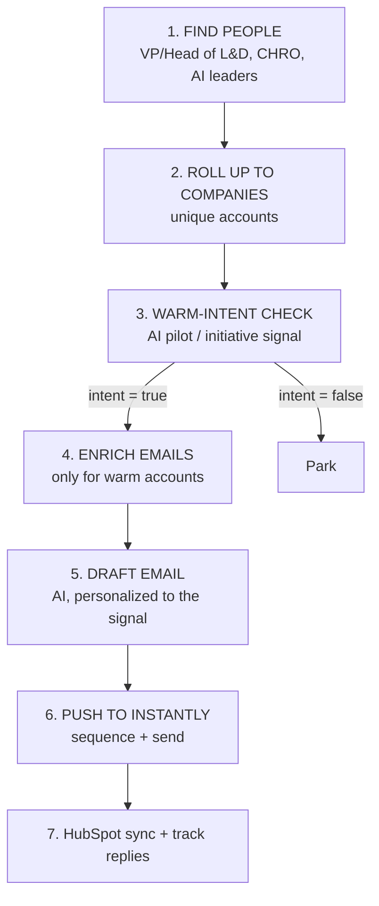

# Scholé Lead-Gen Engine — Clay Build Playbook (US-only)

Your flow: **find decision-makers → narrow to warm-intent companies (AI pilot/initiative) → draft personalized emails → push to Instantly → send.**

Built in Clay because it does people search + company enrichment + AI research (Claygent) + AI copy + push-to-Instantly in one place. (Also literally named in the Scholé job post.)

---

## The flow



> Credit-saving rule: check intent at the company level **before** spending email-verification credits on people.

---

## STEP 1 — Find the decision-makers (People search)
In Clay, start a table from a **"Find People"** source. Filters:
- **Titles:** VP / Head / Director of **Learning & Development**, **People Development**, **Talent Development**; **CHRO** / VP People / Chief People Officer; Chief Learning Officer; + Chief AI Officer / Head of **AI Enablement / AI Transformation**
- **Country:** United States
- **Company headcount:** 500–10,000+
- (Optional) Industries: Software/Tech, Retail, Financial Services, Healthcare

Pull ~300 people to start. You'll get name, title, company, domain, LinkedIn.

## STEP 2 — Roll up to unique companies
Add a Clay **company enrichment** so each person's account is filled in (size, industry, HQ). Dedupe so you check each company's intent once (not once per person).

## STEP 3 — Warm-intent check (the narrowing) — Claygent
This is the filter that turns a cold list into a warm one. Add Claygent research columns at the company level.

**Column: `intent_ai_pilot` (Claygent)**
```
Research {{company_name}} ({{domain}}). Look at news, press releases, blog posts,
leadership LinkedIn posts, and careers pages. Is there evidence they are actively
working on AI adoption internally — e.g., an AI pilot program, AI task force,
"AI center of excellence", generative-AI initiative, or a company-wide rollout of
Copilot / ChatGPT Enterprise / Gemini?
Return strictly JSON:
{"intent": true/false, "signal_type": "<pilot|rollout|task force|initiative|none>",
 "evidence": "<one quote + source URL, or 'none'>"}
```

**Column: `intent_ai_hiring` (Claygent)** (second intent source)
```
Is {{company_name}} currently hiring for any role related to AI enablement,
AI literacy, AI upskilling, "L&D + AI", prompt training, or AI transformation?
Check Greenhouse/Lever/Ashby/LinkedIn Jobs.
Return JSON: {"hiring_ai_role": true/false, "evidence": "<role + URL or 'none'>"}
```

**Filter the table:** keep only companies where `intent_ai_pilot.intent = true` OR `intent_ai_hiring.hiring_ai_role = true`. Everything else → park.

> Optional scoring column if you want ranking: have an AI column output `{"score":0-100,"reason":"..."}` from size + industry + the two intent signals, then sort hottest-first.

## STEP 4 — Enrich emails (only for warm accounts)
Now that the list is narrowed, add Clay **waterfall email enrichment** for the people at warm-intent companies. Keep only verified / safe emails. (Doing this last = big credit savings.)

## STEP 5 — Draft personalized emails (AI column)
**Column: `cold_email`**
```
Write a cold email to {{first_name}}, {{title}} at {{company_name}}.

Use their warmest signal, referenced naturally in the first line:
- AI pilot/initiative: {{intent_ai_pilot}}
- AI hiring: {{intent_ai_hiring}}

About Scholé: an AI-upskilling platform that turns the AI tools companies already
bought into measurable employee adoption — role-specific, adaptive lessons tied to
the tools people use daily (Excel, Notion, Slack), with an HR dashboard for adoption
& mastery. Backed by EPFL/UC Berkeley research; co-teaches Harvard's AI intensives.

Rules:
- 70-90 words, plain text, no "I hope this finds you well", no fluff
- Line 1 = THEIR signal, not about us
- Bridge: most companies running AI pilots stall on adoption, not access
- One CTA: a 20-minute live demo with a founder
- Confident, human, peer-to-peer
Return JSON: {"subject":"...","body":"..."}
```

## STEP 6 — Push to Instantly + send
Use Clay's **HTTP API / integration** column to push each warm, personalized lead into an **Instantly** campaign.

- Map fields → Instantly custom variables: `email`, `first_name`, `company_name`, `{{subject}}`, `{{body}}`.
- Instantly campaign = sequence: email 1 → 2 follow-ups → break-up; **stop on reply**.
- Instantly handles **inbox rotation + warmup** (why it's great for volume).

**Before you "blast" — deliverability or it all hits spam:**
- Buy 2–3 **separate sending domains** (not your main), redirect them
- Set **SPF / DKIM / DMARC** on each
- **Warm up** inboxes 2–3 weeks (Instantly warmup)
- ~20–40 sends/inbox/day, let Instantly rotate across inboxes
- **CAN-SPAM:** real identity + physical address + working unsubscribe

## STEP 7 — Sync + learn (HubSpot)
- Push contacts + reply/meeting activity to **HubSpot** (Scholé's system of record).
- Track open → reply → meeting → contract; note which **signal type** converts best.
- Feed back: weight scoring toward the winning signal, refine the email prompt.

---

## Instantly API — the `deliver()` shape
The push is one HTTP call per lead (Clay HTTP column or your own script). Conceptually:
```
POST https://api.instantly.ai/api/v2/leads
{
  "campaign_id": "<your-campaign>",
  "email": "{{email}}",
  "first_name": "{{first_name}}",
  "company_name": "{{company_name}}",
  "custom_variables": { "subject": "{{subject}}", "body": "{{body}}" }
}
```
(Check Instantly's current API docs for exact field names — they version it.)

---

## Build order (credit-smart)
1. Find ~300 people → 2. enrich companies + dedupe → 3. run intent Claygent → **filter to warm** →
4. enrich emails for survivors only → 5. draft emails → 6. push to Instantly → 7. HubSpot + track.

## For the Scholé application (show, don't mass-blast their market)
- Screenshot the Clay table: people → company intent signal → personalized email.
- 2–3 example generated emails for real warm-intent US accounts.
- One line: "Built this exact pattern solo at Sponsorfi (LLM scraper + lead scoring + outbound). Here it is aimed at your ICP, wired to Instantly + HubSpot."
