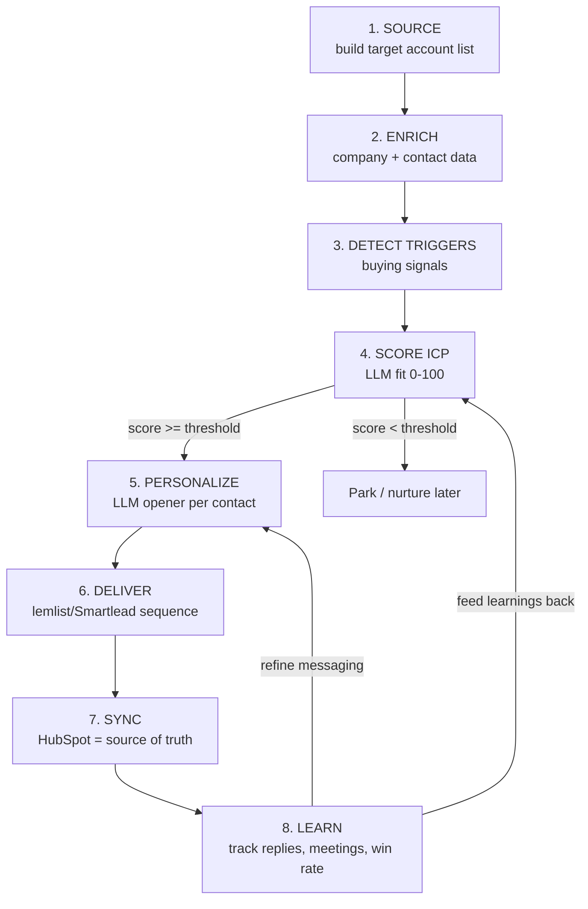

# Scholé — AI-Native Lead Generation Engine (Conceptual Flow)

**Goal:** Turn founder-led sales into a repeatable, automated pipeline. Input = an ICP definition. Output = scored, personalized, sequenced outbound that lands meetings, all tracked in HubSpot.

**Success metric (theirs):** leads → contracts. Everything below optimizes for qualified meetings booked, not emails sent.

---

## The pipeline at a glance

The loop matters: stage 8's results retrain stage 4's scoring and stage 5's messaging. The engine gets smarter every week.

---

## Stage-by-stage

### 1. Source — build the target account list
- **Input:** ICP definition (firmographics + personas + geos).
- **Process:** Pull companies matching the ICP from Apollo / Clay / LinkedIn Sales Navigator, or scrape directly.
- **Scholé ICP to encode:**
  - Size: ~500–10,000+ employees (has a real L&D function + AI budget)
  - Industries: tech, retail, operations-heavy, financial services / regulated
  - Geos: US (SF beachhead) + DACH/EU (Swiss roots, EU AI Act)
- **Output:** raw list of candidate accounts.
- *Your edge:* this is Sponsorfi's sourcing layer, re-pointed.

### 2. Enrich — fill in the data
- **Input:** raw accounts.
- **Process:** attach firmographics (size, industry, HQ, revenue), then find the right people:
  - Personas: Head of L&D, L&D Manager, Chief Learning Officer, Head of People Development, Head of People, + Chief AI Officer / Head of AI Transformation.
  - Get verified work emails (enrichment API) + LinkedIn URLs.
- **Output:** accounts with mapped, contactable decision-makers.

### 3. Detect triggers — find *why now*
- **Input:** enriched accounts.
- **Process:** scrape/monitor for buying signals:
  - Company-wide **Copilot / ChatGPT Enterprise / Gemini rollout** (PR, news, LinkedIn posts)
  - **Hiring** for "AI enablement / AI literacy / L&D – AI / AI transformation" roles
  - **EU AI Act** exposure (EU entity → Article 4 mandates staff AI literacy = forced demand)
  - Leadership **posting** about AI adoption / upskilling
  - Recent **funding** or public AI-transformation initiative
- **Output:** accounts tagged with 0–N active signals + evidence snippet.
- *This is the differentiator* — most outbound is signal-blind. Your LLM-scraper skill makes this the core moat.

### 4. Score ICP — rank by fit × intent
- **Input:** enriched + signal-tagged accounts.
- **Process:** an LLM/ruleset produces a 0–100 score from:
  - Firmographic fit (size/industry/geo match)
  - Intent (number + strength of triggers)
  - Persona reachability (did we find a real decision-maker?)
- **Routing:** `>= threshold` → personalize & send now. `< threshold` → park for nurture.
- **Output:** prioritized queue, hottest first.
- *Your edge:* you built lead scoring at Sponsorfi.

### 5. Personalize — message worth reading
- **Input:** high-score contacts + their evidence snippet.
- **Process:** LLM generates a specific opener referencing *their* trigger
  - e.g., "Saw {Company} is rolling out Copilot to ~3,000 staff — most teams stall at adoption, not access..."
  - Tie to Scholé's value: measurable adoption, role-specific lessons, HR dashboard, EU AI Act readiness.
  - Guardrails: brand voice, length cap, no generic fluff, one clear CTA (20-min founder demo).
- **Output:** per-contact personalized variables for the sequence.

### 6. Deliver — send + sequence
- **Input:** personalized contacts.
- **Process:** push via API into the sending tool as a **swappable `deliver()` step**:
  - lemlist (best HubSpot tie-in) or Smartlead/Instantly (best programmatic scale + inbox rotation)
  - Multi-step sequence: email 1 → follow-ups → break-up; **stop on reply**
  - Deliverability baked in: separate domain, SPF/DKIM/DMARC, warmup, ~20–40/inbox/day, rotation
  - Compliance: CAN-SPAM (US) + GDPR legitimate-interest & opt-out (EU)
- **Output:** live sequences running.

### 7. Sync — HubSpot as source of truth
- **Input:** send + reply activity.
- **Process:** mirror every contact, message, and reply into HubSpot; create/update deals; log sequence status.
- **Output:** clean pipeline the founders can see and work.
- *Note:* the role explicitly says "own and improve our HubSpot setup" — so HubSpot is the system of record, sending tools feed it.

### 8. Learn — close the loop
- **Input:** outcomes (open/reply/meeting/contract).
- **Process:** track conversion at each stage; identify which segments, signals, and messages convert; A/B test.
- **Feedback:** winning patterns raise scoring weights (stage 4) + refine messaging (stage 5).
- **Output:** a compounding, self-improving growth engine.

---

## Minimal data model

| Entity | Key fields |
|---|---|
| **Account** | id, name, domain, size, industry, hq_country, icp_score, status |
| **Contact** | id, account_id, name, title, persona, email, linkedin_url |
| **Signal** | id, account_id, type, evidence_snippet, source_url, detected_at |
| **Message** | id, contact_id, step, subject, body, sent_at, replied |
| **Campaign** | id, name, sequence_steps, segment, metrics |

---

## Build phasing (so v1 ships fast)

- **v1 (demo-able fast):** Stages 1→5 as a script — input companies, output scored + personalized drafts in a sheet/JSON. *This alone wins the application.*
- **v2:** add Stage 6 `deliver()` + Stage 7 HubSpot sync.
- **v3:** add Stage 8 analytics loop + auto-retuning.

---

## How this maps to your Sponsorfi experience (for the application)
- Sourcing + scraping target businesses → Stages 1–2
- LLM-powered local-business scraper, ~80% cheaper per lead → Stage 3 (the moat)
- Lead scoring/qualification → Stage 4
- Personalized cold outreach, 3% signup → Stages 5–6
- You've shipped the whole pattern, solo. This is "I've done this exact thing, here's how I'd aim it at Scholé."
